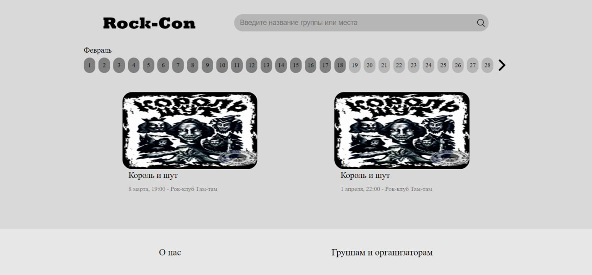
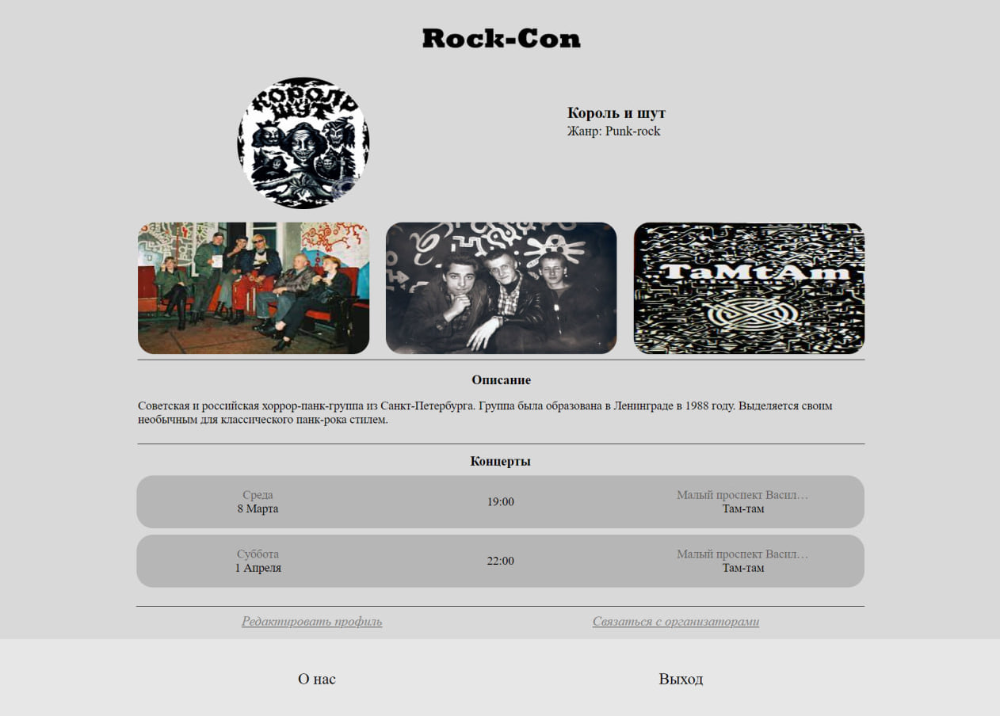
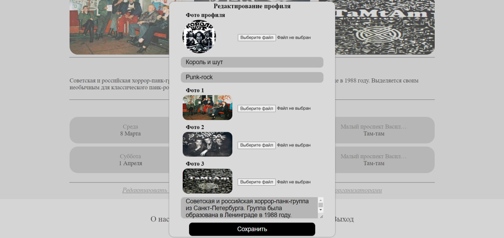
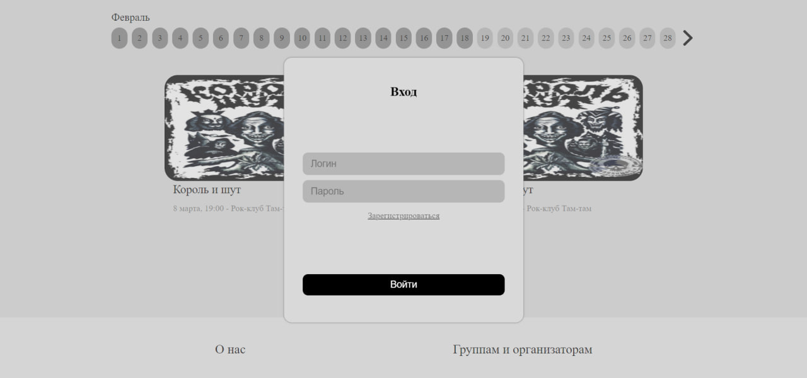
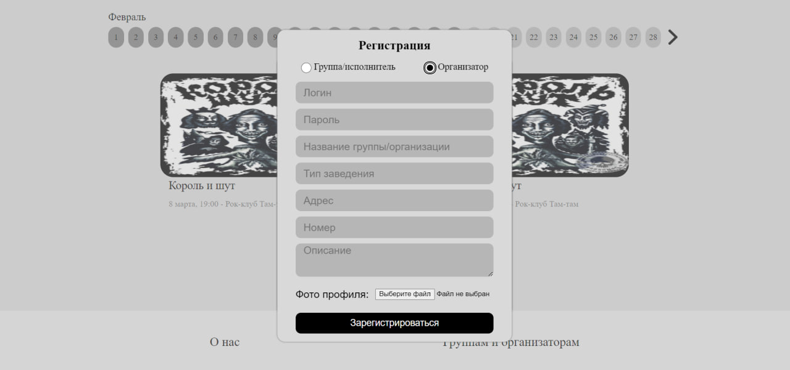

<h1 align="center">:metal: Rock-Con :metal:</h1>



<h2 align="center"><a  href="https://rock-con-firebase-project.web.app/">Demo</a></h2>

## Description
<p>Rock-Con is a web application for:</p>
<p>:guitar: Beginner singers and groups :guitar:</p>
<p>:moneybag: Organizations looking to reach new audiences :moneybag:</p>
<p>:musical_note: People who want to listen lovely musiciants :musical_note:</p>
<p>So music groups or artists can add info about them and connect with organizations.</p>


<p>Organizations also can sign up, sign in, correct info about themselves and add info about concerts by choosing member, time and date.</p>


<p>Users can see info about concerts, groups and organizations. They also can look for concerts by date and search line.</p>

## Technical description
This project is a frontend part of full-stack project. It was implemented by Vue.JS 2. Also it use <a href="https://github.com/vasiliy-poperekov/rock-con_api">Rock-Con Api.</a>

## Project setup
```
npm install
```

### Compiles and hot-reloads for development
```
npm run serve
```

### Compiles and minifies for production
```
npm run build
```

### Customize configuration
See [Configuration Reference](https://cli.vuejs.org/config/).
